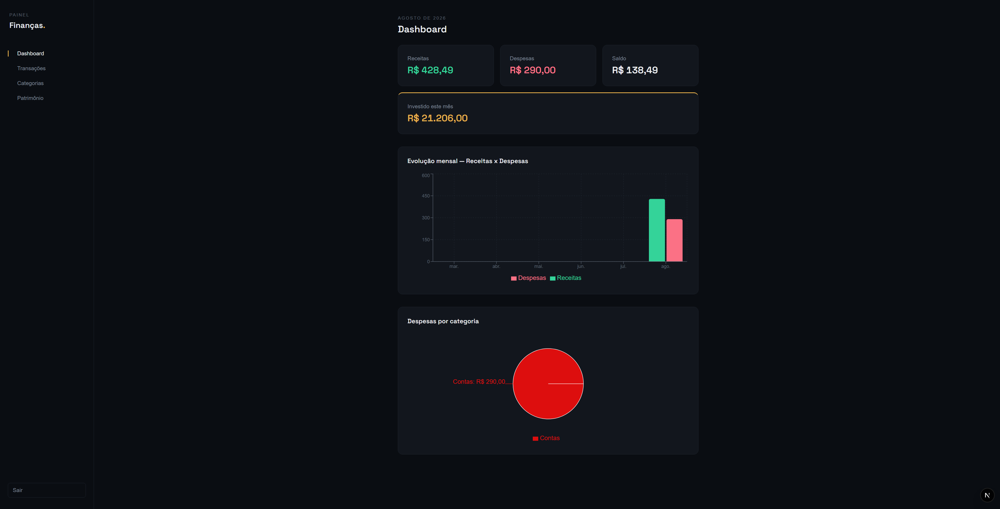
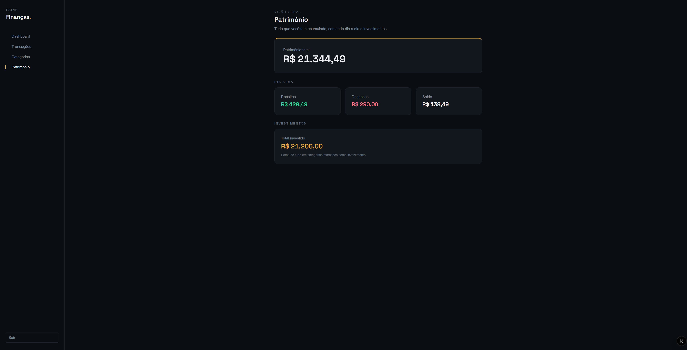

# Finanças+

Sistema de finanças pessoais fullstack para organizar receitas, despesas, categorias e acompanhar a evolução do patrimônio ao longo do tempo.

## Funcionalidades

- **Autenticação** — cadastro e login com sessão via JWT, rotas protegidas
- **Categorias** — criação, edição e exclusão, com cor personalizada e marcação de investimento
- **Transações** — lançamento de receitas e despesas vinculadas a uma categoria
- **Dashboard** — resumo mensal (receitas, despesas, saldo, investido), gráfico de despesas por categoria e evolução mensal dos últimos 6 meses
- **Patrimônio** — visão acumulada, separando saldo do dia a dia de total investido
- **Interface responsiva** — menu lateral no desktop, menu retrátil no mobile


## Capturas de tela

### Dashboard


### Patrimônio



## Tecnologias

- [Next.js](https://nextjs.org/) (App Router) + TypeScript
- [Tailwind CSS](https://tailwindcss.com/)
- [Prisma](https://www.prisma.io/) + PostgreSQL ([Neon](https://neon.tech/))
- [NextAuth.js](https://next-auth.js.org/) (Credentials Provider)
- [Recharts](https://recharts.org/) para os gráficos
- [bcryptjs](https://www.npmjs.com/package/bcryptjs) para hash de senha

## Rodando localmente

1. Clone o repositório e instale as dependências:

```bash
   npm install
```

2. Crie um arquivo `.env` na raiz com as seguintes variáveis:

```env
   DATABASE_URL="sua_connection_string_do_postgresql"
   NEXTAUTH_SECRET="uma_string_aleatoria_segura"
   NEXTAUTH_URL="http://localhost:3000"
```

3. Rode as migrations do Prisma:

```bash
   npx prisma migrate dev
```

4. Inicie o servidor de desenvolvimento:

```bash
   npm run dev
```

5. Acesse `http://localhost:3000`.

## Estrutura do projeto

app/
├── (app)/ # Páginas internas (protegidas), com layout e menu compartilhados
│ ├── dashboard/
│ ├── transacoes/
│ ├── categorias/
│ └── patrimonio/
├── api/ # Rotas de API (auth, categorias, transações, dashboard, patrimônio)
├── login/
├── cadastro/
├── components/ # Componentes compartilhados (ex: Sidebar)
└── page.tsx # Landing page

prisma/
└── schema.prisma # Modelos: User, Category, Transaction, Budget


## Modelo de dados

- **User** — dados do usuário autenticado
- **Category** — categorias de receita/despesa, com flag `isInvestment`
- **Transaction** — lançamentos vinculados a uma categoria e um usuário
- **Budget** — estrutura para metas de orçamento (não implementado na interface ainda)